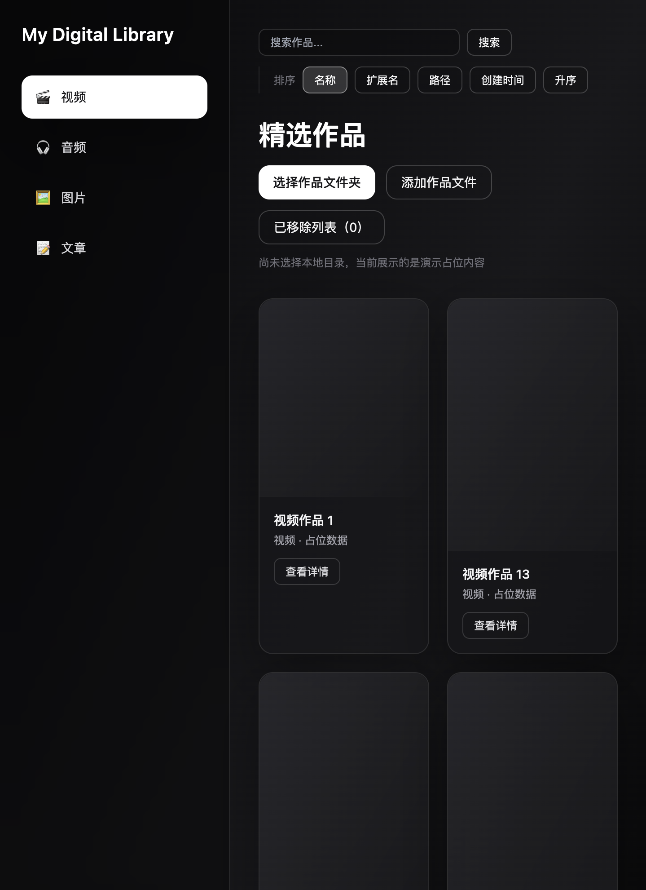

# My Digital Library

本地数字媒体库桌面应用：扫描文件夹、按类型浏览、搜索与排序，并在应用内预览视频、音频与图片。

基于 [Tauri 2](https://v2.tauri.app/) + [React](https://react.dev/) + [Vite](https://vite.dev/) + [Rust](https://www.rust-lang.org/)。

## 功能

- **库管理**：绑定根目录扫描，或单独添加文件；支持固定多个根路径
- **分类浏览**：视频、音频、图片、文章
- **搜索与排序**：按名称、扩展名、路径、创建时间排序（升序 / 降序），偏好写入 `localStorage`
- **详情预览**：弹层内查看元信息；视频 / 音频 / 图片内联播放
- **文件操作**：在 Finder 中显示、用系统默认应用打开、移动、删除、系统分享（macOS）
- **笔记与隐藏**：为作品写备注、从列表隐藏；可查看已隐藏项
- **发布辅助**：可配置分享文案模板（复制到剪贴板）

## 截图

<!-- 建议在仓库中添加 docs/screenshots/ 并替换下方链接 -->
<!--  -->

## 环境要求

| 依赖 | 说明 |
|------|------|
| [Node.js](https://nodejs.org/) | 建议 LTS（用于前端与 Tauri CLI） |
| [Rust](https://www.rust-lang.org/tools/install) | `rustup` 安装 stable toolchain |
| macOS | 当前主要开发与打包目标；其他平台需自行验证 Tauri bundle |

## 从源码运行

```bash
git clone https://github.com/libindury1978/MyDigitalLibrary.git
cd MyDigitalLibrary
npm install
npm run tauri dev
```

## 构建 macOS 应用

在项目根目录执行（会生成并复制到 `release/My Digital Library.app`）：

```bash
npm run build:release-app
```

也可使用 Tauri 默认输出：

```bash
npm run tauri build
```

预编译安装包请见 [GitHub Releases](https://github.com/libindury1978/MyDigitalLibrary/releases)（若已发布）。

## 项目结构

```
├── src/                 # React 前端
│   ├── components/      # UI 组件（详情弹层、音视频播放器等）
│   ├── hooks/           # 持久化状态等
│   ├── lib/             # 排序、合并等纯函数
│   ├── types/           # TypeScript 类型
│   └── constants/       # 分类、存储键等
├── src-tauri/           # Rust 后端（扫描、文件操作、分享）
└── release/             # 本地打包输出（已 gitignore，不入库）
```

## 参与贡献

欢迎 Issue 与 Pull Request。请先阅读 [CONTRIBUTING.md](CONTRIBUTING.md)。

## 安全

若发现安全问题，请按 [SECURITY.md](SECURITY.md) 私下报告，勿在公开 Issue 中披露细节。

## 许可证

本项目采用 [Apache License 2.0](LICENSE) 开源。

Copyright 2026 Benny
