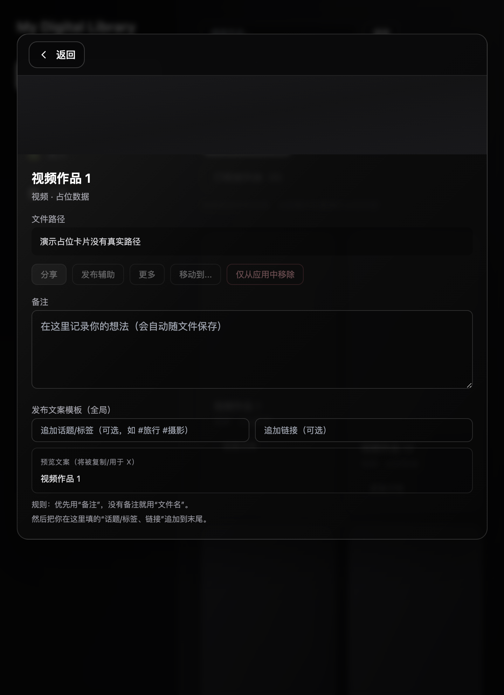

# My Digital Library

**本地数字媒体库桌面应用** · Local digital media library desktop app

扫描文件夹、按类型浏览、搜索与排序，并在应用内预览视频、音频与图片。支持应用内 **中文 / English** 界面切换。

Scan folders, browse by type, search and sort, and preview video, audio, and images in-app. Switch UI language between **中文** and **English** in the sidebar.

Built with [Tauri 2](https://v2.tauri.app/) + [React](https://react.dev/) + [Vite](https://vite.dev/) + [Rust](https://www.rust-lang.org/).

**Languages:** [中文](#中文) · [English](#english)

---

## 截图 · Screenshots

| 主界面 / Main | 作品详情 / Detail |
|:---:|:---:|
|  |  |

---

<a id="中文"></a>
## 中文

### 功能

- **库管理**：绑定根目录扫描，或单独添加文件；支持固定多个根路径
- **分类浏览**：视频、音频、图片、文章
- **搜索与排序**：按名称、扩展名、路径、创建时间排序（升序 / 降序），偏好写入 `localStorage`
- **详情预览**：弹层内查看元信息；视频 / 音频 / 图片内联播放
- **文件操作**：在 Finder 中显示、用系统默认应用打开、移动、删除、系统分享（macOS）
- **笔记与隐藏**：为作品写备注、从列表隐藏；可查看已隐藏项
- **发布辅助**：可配置分享文案模板（复制到剪贴板）
- **界面语言**：侧边栏底部可切换中文 / English，选择会保存在本地

### 环境要求

| 依赖 | 说明 |
|------|------|
| [Node.js](https://nodejs.org/) | 建议 LTS（用于前端与 Tauri CLI） |
| [Rust](https://www.rust-lang.org/tools/install) | `rustup` 安装 stable toolchain |
| macOS | 当前主要开发与打包目标；其他平台需自行验证 Tauri bundle |

### 从源码运行

```bash
git clone https://github.com/libindury1978/MyDigitalLibrary.git
cd MyDigitalLibrary
npm install
npm run tauri dev
```

### 构建 macOS 应用

在项目根目录执行（会生成并复制到 `release/My Digital Library.app`）：

```bash
npm run build:release-app
```

也可使用 Tauri 默认输出：

```bash
npm run tauri build
```

预编译安装包请见 [GitHub Releases](https://github.com/libindury1978/MyDigitalLibrary/releases/latest)（macOS：`My_Digital_Library_*_aarch64.dmg` 或 `.app.zip`）。

发布 GitHub 元数据与 Release 资源（需已 `gh auth login`）：

```bash
./scripts/github-publish.sh 0.1.0
```

### 项目结构

```
├── src/
│   ├── i18n/            # 中英文文案
│   ├── components/      # UI 组件
│   ├── hooks/           # 持久化状态等
│   ├── lib/             # 排序、分类、合并等
│   ├── types/
│   └── constants/
├── src-tauri/           # Rust 后端（扫描、文件操作、分享）
└── release/             # 本地打包输出（gitignore，不入库）
```

### 参与贡献

欢迎 Issue 与 Pull Request。请先阅读 [CONTRIBUTING.md](CONTRIBUTING.md)。

### 安全

若发现安全问题，请按 [SECURITY.md](SECURITY.md) 私下报告，勿在公开 Issue 中披露细节。

### 许可证

本项目采用 [Apache License 2.0](LICENSE) 开源。Copyright 2026 Benny

---

<a id="english"></a>
## English

### Features

- **Library**: Scan a root folder or add individual files; pin multiple root paths
- **Categories**: Video, audio, images, articles
- **Search & sort**: By name, extension, path, or created time (asc/desc); preferences stored in `localStorage`
- **Detail view**: Metadata and inline playback for video, audio, and images
- **File actions**: Reveal in Finder, open with default app, move, delete, system share (macOS)
- **Notes & hide**: Per-item notes and hide from list; restore from removed list
- **Publish assist**: Global template for share text (copy to clipboard)
- **UI language**: Switch 中文 / English in the sidebar; choice is saved locally

### Requirements

| Dependency | Notes |
|------------|--------|
| [Node.js](https://nodejs.org/) | LTS recommended (frontend + Tauri CLI) |
| [Rust](https://www.rust-lang.org/tools/install) | stable toolchain via `rustup` |
| macOS | Primary build target; other platforms untested |

### Run from source

```bash
git clone https://github.com/libindury1978/MyDigitalLibrary.git
cd MyDigitalLibrary
npm install
npm run tauri dev
```

### Build for macOS

From the project root (outputs to `release/My Digital Library.app`):

```bash
npm run build:release-app
```

Or use the default Tauri bundle path:

```bash
npm run tauri build
```

Pre-built binaries: [GitHub Releases](https://github.com/libindury1978/MyDigitalLibrary/releases/latest) (`My_Digital_Library_*_aarch64.dmg` or `.app.zip`).

To update repo description, topics, and upload release assets (requires `gh auth login`):

```bash
./scripts/github-publish.sh 0.1.0
```

### Project layout

```
├── src/
│   ├── i18n/            # zh / en strings
│   ├── components/
│   ├── hooks/
│   ├── lib/
│   ├── types/
│   └── constants/
├── src-tauri/           # Rust (scan, file ops, share)
└── release/             # local build output (gitignored)
```

### Contributing

Issues and pull requests are welcome. See [CONTRIBUTING.md](CONTRIBUTING.md).

### Security

Report vulnerabilities privately per [SECURITY.md](SECURITY.md). Do not file public issues with exploit details.

### License

Licensed under [Apache License 2.0](LICENSE). Copyright 2026 Benny
